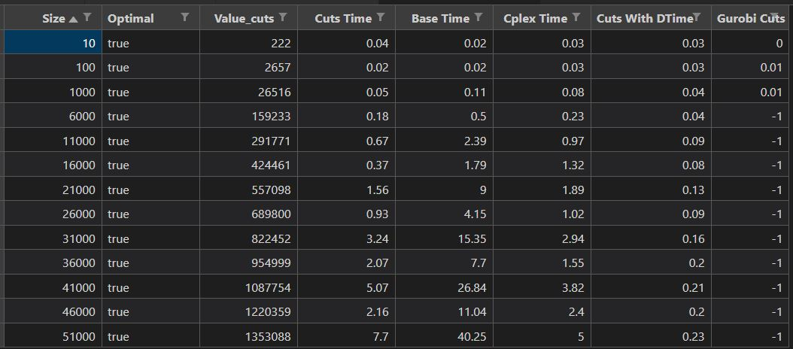

# Rapport Alexis Barreaux

## Décomposition manuelle Benders

La décomposition manuelle est un peu longue à mettre en place (à comparer en relatif par rapport à l'utilisation du paramètre CPLEX), surtout si on avait dû gérer manuellement les coupes de faisabilité en plus, ce qu'on a pu éviter ici grâce aux conseils fournis. Toutefois, pour ce problème cette version scale de manière convaincante (voir colonne Cuts time de l'image ci-dessous) avec seulement quelques secondes pour plus de 50000 variables. A noter toutefois que les instances générées augmentent la combinatoire (le nombre de "cinémas") mais n'ajoutent pas de contraintes sur les liens entre ces nouveaux cinémas. Notre problème est donc faiblement contraint.

## Modèle de base sans décomposition

Sans utiliser la décomposition, ce problème très simple reste tractable mais beaucoup plus lent (de l'ordre de 5 fois plus sur les grandes instances, voir tableau colonne Base Time). Il semble que CPLEX ne sache pas reconnaître tout seul avec ses heuristiques que le problème est décomposable.

## Décomposition automatique par CPLEX

En imposant à CPLEX d'utiliser la décomposition, on a des temps comparables à la décomposition manuelle (voir colonne Cplex Time). Toutefois, ce système "explose en vol" à partir de 60000 variables environ : ie qu'il n'arrive plus à résoudre les instances, pour 61000 par exemple même la version sans décomposition termine en 55s mais lui ne termine pas en 20 minutes au moins. Il pourrait être intéressant d'afficher le gap et de voir si il reste rapidement proche de l'optimal cependant pour les instances. Pour 61000 cinémas, l'optimal est à 1.618E6 environ. Or en 60 secondes CPLEX trouve 2.397e6 et un gap de 40% pour une borne de 1.444e6, en 120 secondes il reste bloqué sur exactement cette même valeur réalisable et la même borne. Il semble qu'il n'arrive donc plus à s'améliorer.

## Décomposition manuelle sans PL par CPLEX

La version améliorée où on évite le PL est très intéressante, c'est elle qui est la plus efficace (colonne Cuts With DTime) et reste relativement inchangée en temps de 10 à 50000 variables. Cela signifie a priori qu'une grande partie des appels aux sous-problèmes sont soumis à cette contrainte et qu'on évite ainsi souvent le PL.

## Décomposition manuelle sans PL par Gurobi

Sans licence suffisante je ne peux pas vérifier l'impact de Gurobi.

## Résultats
